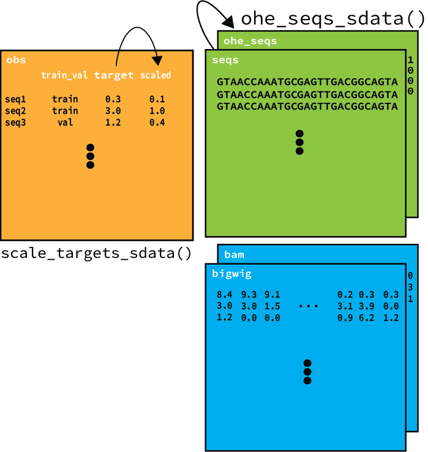

[](https://badge.fury.io/py/seqdata)




# SeqData (Annotated sequence data)

[[documentation](https://seqdata.readthedocs.io/en/latest/)][[tutorials]()]

SeqData is a Python package for preparing ML-ready genomic sequence datasets. Some of the key features of SeqData include:

- Keeps multi-dimensional data in one object (e.g. sequence, coverage, metadata, etc.)
- Efficiently and flexibly loads of track-based data from BigWig or BAM
- Fully compatible with PyTorch dataloading
- Offers out-of-core dataloading from disk to CPU to GPU

> [!NOTE] 
> The API for SeqData has largely been decided on, but may change slightly across versions until the first major release.

## Installation

`pip install seqdata`

## Roadmap

Although my focus will largely follow my research projects and the feedback I receive from the community, here is a roadmap for what I currently plan to focus on in the next few releases.

- v0.1.0: ✔️ Initial API for reading BAM, FASTA, BigWig and Tabular data and building loading PyTorch dataloaders
- v0.2.0: (WIP) Bug fixes, improved documentation, tutorials, and examples
- v0.X.0: Improved out of core functionality, robust BED classification datasets
- v0.X.4 — Interoperability with AnnData and SnapATAC2

## Quickstart
The below examples illustrate the simplest way to read in data from commonly used file formats. For a more comprehensive guide to using the SeqData API, see the full [documentation](https://seqdata.readthedocs.io/en/latest/).

### Loading sequences from "flat" files
The simplest way to store genomic sequence data is as plain text strings in a table. For reading sequences from one or more csv/tsv files, use the `read_table` function:

```python
from seqdata import read_table
sdata = sd.read_table(
    name="seq",  # name of resulting xarray variable containing sequences
    out="sdata.zarr",  # output file
    tables=["sequences.tsv"],  # list of tabular files
    seq_col="seq_col",  # column containing sequences
    fixed_length=False,  # whether all sequences are the same length
    batch_size=1000,  # number of sequences to load at once
    overwrite=True,  # overwrite the output file if it exists
)
```

These "fixed" sequences can also be stored in FASTA format. In SeqData, we call this a "flat" fasta file. Use the `read_flat_fasta` function to read sequences from such a file:

```python
from seqdata import read_flat_fasta
sdata = sd.read_flat_fasta(
    name="seq",  # name of resulting xarray variable containing sequences
    out="sdata.zarr",  # output file
    fasta="sequences.fa",  # fasta file
    fixed_length=False,  # whether all sequences are the same length
    batch_size=1000,  # number of sequences to load at once
    overwrite=True,  # overwrite the output file if it exists
)
```

### Loading sequences from genomic coordinates
Sequences are commonly implicity referenced in FASTA files using genomic coordinates in BED-like files rather than fully specified as above. We can use `read_genome_fasta` to load sequences from a genome fasta file using regions in a BED-like file:

```python
from seqdata import read_genome_fasta
sdata = sd.read_genome_fasta(
    name="seq",  # name of resulting xarray variable containing sequences
    out="sdata.zarr",  # output file
    fasta="genome.fa",  # fasta file
    bed="regions.bed",  # bed file
    fixed_length=False,  # whether all sequences are the same length
    batch_size=1000,  # number of sequences to load at once
    overwrite=True,  # overwrite the output file if it exists
)
```

### Loading read depth from BAM files
In functional genomics, we often work with aligned sequence reads stored in BAM files. In many applications, it is useful to quantify the pileup of reads at each position to describe a signal of interest (e.g. protein binding, chromatin accessibility, etc.). Used in combination with BED-like files, we can extract both sequences and base-pair resolution read pileup with the `read_bam` function:

```python
from seqdata import read_bam
sdata = sd.read_bam(
    name="seq",  # name of resulting xarray variable containing sequences
    out="sdata.zarr",  # output file
    bams=["data.bam"],  # list of BAM files
    seq_col="seq_col",  # column containing sequences
    fixed_length=False,  # whether all sequences are the same length
    batch_size=1000,  # number of sequences to load at once
    overwrite=True,  # overwrite the output file if it exists
)
```

Because BAM files contain read alignments, we can use different strategies for quantifying the pileup at each position. See the TODO for a deeper dive into...TODO

### Loading read depth from BigWig files
BAM files can be quite large and often carry more information than we need. [BigWig files](https://genome.ucsc.edu/goldenpath/help/bigWig.html) are a common way to store quantitative values at each genomic position (e.g. read depth, methylation fraction, etc.)

```python
from seqdata import read_bigwig
sdata = sd.read_bigwig(
    name="seq",  # name of resulting xarray variable containing sequences
    out="sdata.zarr",  # output file
    bigwigs=["data.bw"],  # list of BigWig files
    seq_col="seq_col",  # column containing sequences
    fixed_length=False,  # whether all sequences are the same length
    batch_size=1000,  # number of sequences to load at once
    overwrite=True,  # overwrite the output file if it exists
)
```

### Building a dataloader
One of the main goals of SeqData is to allow a seamless flow from files on disk to machine learning ready datasets. This can be achieved after loading data from the above functions by building a PyTorch dataloader with the `get_torch_dataloader` function:

```python
from seqdata import get_torch_dataloader
dl = sd.get_torch_dataloader(
        sdata,  # SeqData object (e.g. as returned by read_table)
        sample_dims="_sequence",  # dimension to sample along
        variables=["seqs"],  # list of variables to include in the dataloader
        batch_size=2,
    )
```

This generates a PyTorch dataloader that returns batches as Python dictionaries with the specified variables as keys.
