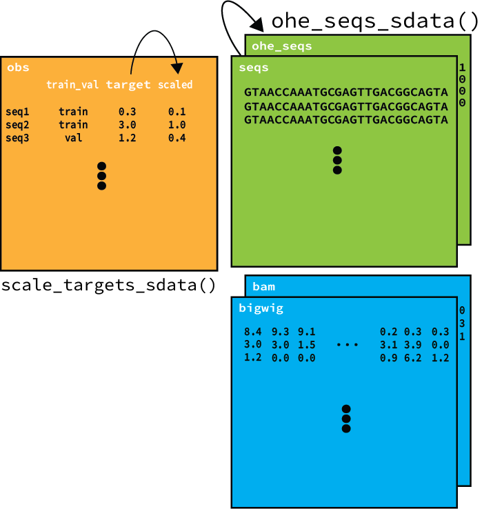

# SeqData -- Annotated biological sequence data


SeqData is a Python package for loading genomics sequenced-based data from a variety of file formats into [xarray](https://xarray.pydata.org/en/stable/) objects. SeqData provides a unified interface for loading two major types of data:

1. Genomic sequences:
* **TSV** -- explicitly defined sequences in tabular format (e.g. CSV)
* **FASTA** -- explicitly defined sequences in FASTA format
* **BED** -- implicitly define sequences corresponding to genomic start and end coordinates

2. Read alignment/coverage data (paired with a reference genome):
* **BAM** -- summarizes read alignments that overlap a genomic region
* **BigWig** -- summarizes coverage data that overlaps a genomic region

SeqData is designed to be used via its Python API.

# Getting started
* {doc}`Install SeqData <installation>`
* Browse the main {doc}`API <api>`

# Contributing
SeqData is an open-source project and we welcome contributions from the community.

```{toctree}
:hidden: true
:maxdepth: 1

installation
api
contributors
